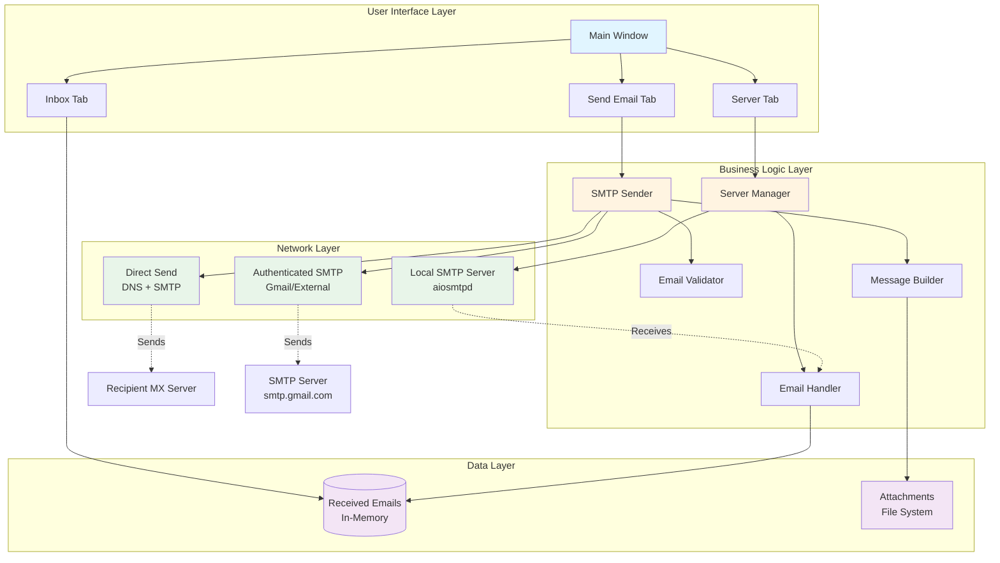

<div align="center">

# Python Email Server with GUI

[](https://www.python.org/)
[](LICENSE)
[](https://github.com/kiprutobeauttah/Email-server)
[](https://www.python.org/dev/peps/pep-0008/)
[](CONTRIBUTING.md)

A full-featured SMTP email server with GUI for sending real emails and testing locally.

[Features](#features) • [Installation](#installation) • [Usage](#usage) • [Architecture](#architecture) • [Documentation](#documentation)

</div>

---

## Features

### Core Functionality
-  **Dual Mode Operation**
  - Local Mode - Test emails locally without internet
  - External Mode - Send real emails via Gmail/other SMTP servers
  - Direct Send - Attempt delivery without authentication

### Email Capabilities
-  **Send Real Emails** - Deliver to Gmail, Yahoo, Outlook, etc.
-  **File Attachments** - Attach multiple files to emails
-  **CC/BCC Support** - Send to multiple recipients
-  **Inbox Management** - View, clear, and refresh received emails

### Technical Features
-  **Modern GUI** - Easy-to-use tkinter-based interface
-  **SMTP Server** - Built-in server using modern aiosmtpd
-  **Server Log** - Real-time activity monitoring with timestamps
-  **Email Validation** - Format validation before sending
-  **Connection Testing** - Verify SMTP settings before sending

## Architecture



### Component Overview

| Component | Responsibility | Technology |
|-----------|---------------|------------|
| **GUI Layer** | User interaction and display | tkinter |
| **Server Manager** | SMTP server lifecycle management | aiosmtpd, threading |
| **SMTP Sender** | Email transmission logic | smtplib, dnspython |
| **Email Handler** | Process incoming emails | aiosmtpd handlers |
| **Validators** | Input validation and sanitization | regex, custom logic |

## Quick Start

```bash
# Clone the repository
git clone https://github.com/kiprutobeauttah/Email-server.git
cd Email-server

# Install dependencies
pip install -r requirements.txt

# Run the application
python main.py
```

## Installation

## Project Structure

```
Email-server/
├── main.py                 # Application entry point
├── src/
│   ├── __init__.py
│   ├── email_handler.py    # Incoming email handler
│   ├── server_manager.py   # SMTP server management
│   ├── smtp_sender.py      # Email sending logic
│   ├── validators.py       # Input validation
│   └── gui/
│       ├── __init__.py
│       ├── main_window.py  # Main GUI window
│       ├── server_tab.py   # Server control tab
│       ├── send_tab.py     # Send email tab
│       └── inbox_tab.py    # Inbox tab
├── requirements.txt        # Python dependencies
├── .gitignore
└── README.md
```

## Usage

## Usage Examples

### 1. **Server Tab** (for receiving emails locally)
   - Enter host (default: localhost) and port (default: 1025)
   - Click "Start Server" to begin receiving emails
   - Monitor incoming emails in the server log
   - Click "Stop Server" to stop receiving emails

### 2. **Send Email Tab**
   
   **SMTP Configuration:**
   - **Local Mode** - Send to your local server for testing
   - **External Mode** - Send real emails to Gmail, etc.
     - Enter SMTP server (e.g., smtp.gmail.com)
     - Enter port (587 for Gmail)
     - Enter your email and App Password
     - Click "Test Connection" to verify settings
   
   **Email Details:**
   - Fill in From, To, CC, BCC, Subject, and Message
   - Add file attachments using "Add File" button
   - Multiple recipients supported (comma-separated)
   - Click "Send Email" to send

### 3. **Inbox Tab**
   - View all received emails in the list
   - Click on an email to view its full content
   - Use "Refresh" to update the display
   - Use "Clear Inbox" to delete all emails
   - Email counter shows total received emails

## Testing Scenarios

### Local Testing
1. Start the server using the "Server" tab
2. Switch to "Send Email" tab (keep "Local Mode" selected)
3. Send a test email
4. Check the "Inbox" tab to see the received email

## Configuration

### Gmail SMTP Setup
1. **Setup Gmail App Password:**
   - Go to myaccount.google.com/apppasswords
   - Enable 2-Factor Authentication if not already enabled
   - Generate an App Password for "Mail"
   - Copy the 16-character password

2. **Configure in App:**
   - Switch to "Send Email" tab
   - Select "External (Real Emails)" mode
   - SMTP Server: smtp.gmail.com
   - Port: 587
   - Email: your-email@gmail.com
   - Password: [paste your App Password]
   - Click "Test Connection" to verify

3. **Send Email:**
   - Fill in recipient (e.g., kiprutobeauttah@gmail.com)
   - Add subject and message
   - Click "Send Email"
   - Email will be delivered to the real recipient!

## Technologies Used

| Technology | Purpose | Version |
|------------|---------|---------|
|  | Core Language | 3.7+ |
|  | GUI Framework | Built-in |
|  | Async SMTP Server | 1.4.4+ |
|  | DNS Resolution | 2.3.0+ |
|  | SMTP Client | Built-in |

## Contributing

Contributions are welcome! Please feel free to submit a Pull Request.

1. Fork the repository
2. Create your feature branch (`git checkout -b feature/AmazingFeature`)
3. Commit your changes (`git commit -m 'Add some AmazingFeature'`)
4. Push to the branch (`git push origin feature/AmazingFeature`)
5. Open a Pull Request

## License

This project is licensed under the MIT License - see the LICENSE file for details.

## Author

**Kipruto Beauttah**

[](https://github.com/kiprutobeauttah)
[](mailto:kiprutobeauttah@gmail.com)

## Support

If this project helped you, please consider giving it a star on GitHub!

## Screenshots

### Server Tab


### Send Email Tab


### Inbox Tab


## Disclaimer

This is a development tool. Do not use in production environments without proper security measures.

## Known Issues

- Direct send mode may not work if ISP blocks port 25
- Some email providers may reject unauthenticated emails
- Emails sent via direct mode often end up in spam

## Resources

- [Gmail App Passwords](https://myaccount.google.com/apppasswords)
- [SMTP Protocol](https://tools.ietf.org/html/rfc5321)
- [aiosmtpd Documentation](https://aiosmtpd.readthedocs.io/)

---

<div align="center">
  
### Written by
  
<h2>
  
</h2>

[](https://github.com/kiprutobeauttah)
[](https://linkedin.com/in/kiprutobeauttah)
[](https://kiprutobeauttah.github.io)


</div>
